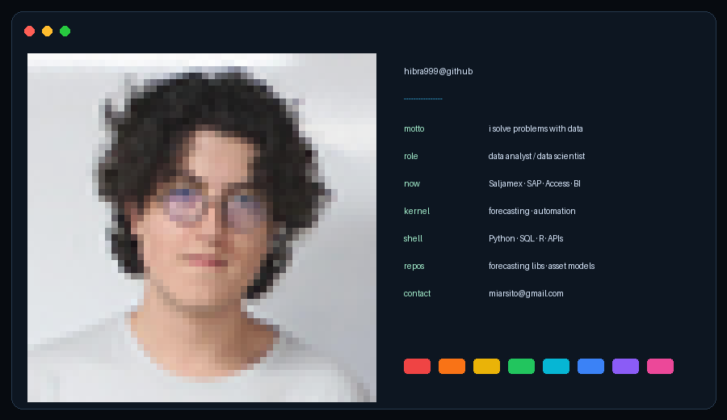
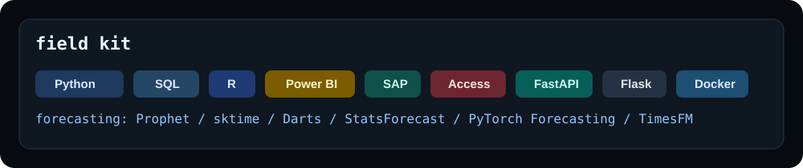

# I solve problems with data.



I build practical data systems: cleaning messy sources, automating manual work,
forecasting temporal behavior, and turning analysis into tools people can use.

## Direction

| Area | What I work on |
| --- | --- |
| Business data | SAP, Access, Power BI, Excel, operational reporting |
| Forecasting | statistical models, ML regressors, backtesting, leakage checks |
| Automation | Python scripts, data cleaning, repetitive-process reduction |
| Audit data | anomaly checks, public-audit apps, statistical summaries |

<p align="center">
  
</p>

## Stack

```txt
Languages      Python, R, SQL
Data           pandas, NumPy, Polars, SciPy
ML             scikit-learn, TensorFlow, Keras, PyTorch
Forecasting    Prophet, sktime, Darts, StatsForecast, PyTorch Forecasting, TimesFM
BI / Ops       Power BI, Excel, SAP, Microsoft Access
Apps           Flask, FastAPI, SQLite, Docker, Git, Jupyter
AI             Codex, Claude Code, LLMs, NLP
```

## Experience

**Data Analyst / Analista de Control Operativo**  
Saljamex  
September 2026 - Present

- Learning and applying SAP and Microsoft Access for data management and reporting.
- Building and improving Power BI dashboards for business analysis.
- Automating manual processes to reduce repetitive work.

**Data Scientist**  
Organ of Superior Auditing of the State of Tlaxcala (OFS)  
February 2021 - June 2026

- Built and maintained a Flask + SQLite application for public audit work.
- Cleaned and transformed raw data from multiple sources with Python.
- Automated reports, statistical summaries, and repetitive data-entry tasks.

## Projects

**Awesome-forecasting-skills**  
[github.com/Hibra999/Awesome-forecasting-skills](https://github.com/Hibra999/Awesome-forecasting-skills)

- Reusable Python modules for time series forecasting, classification, and anomaly detection.
- Integrated 30+ open-source libraries into consistent pipelines.
- Added backtesting utilities to check model accuracy and prevent data leakage.

**Financial Asset Prediction Ensemble**

- Built a stacking model combining CatBoost, LightGBM, TimeXer, Moirai-MoE, and LSTM.
- Tested with equities and crypto assets including Nvidia, Apple, Bitcoin, and Ethereum.
- Used MICFS feature selection for technical and macroeconomic indicators.

## Education

**Instituto Politecnico Nacional**  
Bachelor's Degree in Data Science, in progress  
2022 - 2026

## Certifications

- Excel Intermediate
- TOEFL ITP B2+

## Contact

- Email: [miarsito@gmail.com](mailto:miarsito@gmail.com)
- LinkedIn: [israel-hibraim-hernandez-zarate](https://www.linkedin.com/in/israel-hibraim-hernandez-zarate-0a5671321)
